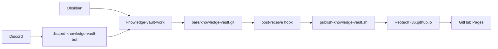
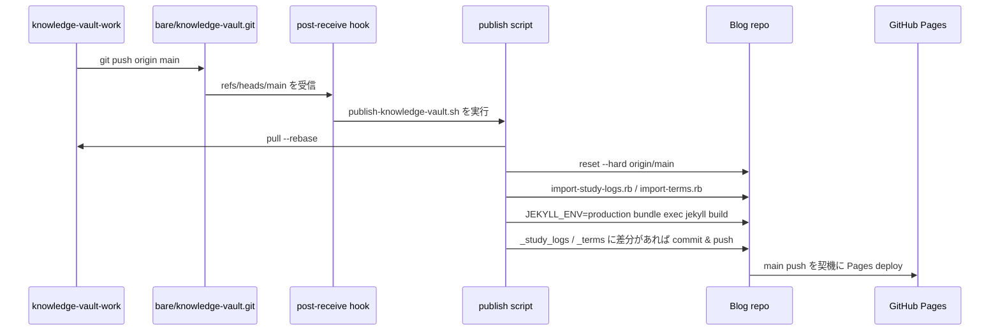

## はじめに

このブログに、個人用のナレッジベースとして [技術メモ](/terms/) と [学習記録](/study-logs/) を追加しました

技術メモは用語や概念を後から引くための辞書で、学習記録は日々の作業や気づきを時系列で残すログです

やりたかったことは、個人開発や業務で得た知識を「あとで記事にするかもしれないメモ」として溜めることです  
ただし、ブログのリポジトリを直接編集する運用にすると、気軽さがなくなります

そこで、Obsidian を母艦にした `knowledge-vault-work` を作り、そこからブログ用 Markdown を生成するパイプラインを組みました  
さらに、思いついた瞬間に Discord からも追加できるように、専用の Discord Bot も作っています

## 作ったもの

今回追加した入口は次の 2 つです

- [技術メモ](/terms/): AWS、Docker、Shell などの用語を整理する辞書
- [学習記録](/study-logs/): 日々の学びや作業ログを残す場所

元データはブログリポジトリではなく、Obsidian で扱う `knowledge-vault-work` に置いています  
ブログ側の `_terms/` と `_study_logs/` は生成物として扱い、source of truth は vault 側に寄せています

## 全体構成

全体像は次のような構成です

ポイントは、ブログのためだけに Obsidian のノートを直接公開しないことです  
vault 側では自分が書きやすい形を保ち、公開対象だけを import script で Jekyll 用に変換しています

## bare リポジトリを使う理由

この構成では `bare/knowledge-vault.git` という bare リポジトリを挟んでいます

bare リポジトリは、作業ツリーを持たない Git リポジトリです  
普通のリポジトリのようにファイルを編集する場所ではなく、push を受け取るための受け口として使います

今回の使い方では、`knowledge-vault-work` から bare リポジトリへ push すると、`post-receive` hook が動きます  
この hook からブログ側の publish script を起動して、公開用 Markdown の生成までつなげています

## 公開パイプライン

公開までの流れは次の通りです

ブログ側では `scripts/import-study-logs.rb` と `scripts/import-terms.rb` が、vault の Markdown を Jekyll の collection に変換します

変換対象は `publish: true` のノートだけです  
これにより、Obsidian 側には下書きや個人的なメモを残しつつ、公開するものだけをブログに流せます

また、Obsidian の `[[EC2]]` のような wiki link は、公開済みの技術メモであれば `/terms/ec2/` のようなリンクに変換します  
まだ公開していない用語は、リンクではなく「準備中の用語」として表示します

## Discord Bot から追加できるようにした

Obsidian は腰を据えて整理するには便利ですが、スマホから一瞬で追加するには少し重いです  
そこで、Discord から技術メモと学習記録を追加できる `discord-knowledge-vault-bot` を作りました

Bot には次の 2 つの slash command を用意しています

- `/term_add`: `01_terms/<slug>.md` に技術メモを作成
- `/study_log_add`: `03_study_logs/YYYY-MM-DD-study-log.md` に学習記録を作成

`/term_add` の modal は次のような形です

Discord の modal は Text Input を最大 5 つまでしか置けません  
そのため、技術メモでは入力欄を次の 5 つに絞りました

- `title:slug`
- `category`
- `一言でいうと`
- `より具体的には`
- `関連`

`title` と `slug` を別入力にすると、それだけで入力枠を 2 つ使ってしまいます  
そこで `セキュリティグループ:security-group` のように 1 つの欄にまとめ、残りを本文や関連用語に使えるようにしました

## Bot 側の運用

Bot は Docker Compose で常駐させています  
`knowledge-vault-work` と bare リポジトリを volume mount し、Bot から vault に Markdown を作成して commit / push します

運用上のポイントは次の 3 つです

- `DISCORD_ALLOWED_USER_IDS` で実行できるユーザーを制限する
- Git 操作前に vault の worktree が dirty なら停止する
- `gitBusy` で同時に複数の Git 操作が走らないようにする

Discord から作成したノートにも `publish: true` を入れるので、push 後は既存の publish pipeline がそのまま動きます  
Bot は「ノートを作って push するところ」までを担当し、ブログへの変換は既存パイプラインに任せています

## 実装してよかったこと

一番よかったのは、知識を残す心理的なハードルが下がったことです

PC の前にいるときは Obsidian で整理し、外出中や作業中に思いついたことは Discord から追加できます  
どちらから入れても最終的には同じ `knowledge-vault-work` に集まり、公開対象だけがブログに流れます

また、Terms と Study Logs を分けたことで、用語として整理したいものと、日々の作業ログとして残したいものを分けられるようになりました

## 今後やりたいこと

今後は、カテゴリや未分類の整理をもう少し進めたいです  
特に技術メモは数が増えるほど探しやすさが重要になるので、カテゴリ設計と検索体験を育てていきたいところです

Discord 側も、modal の 5 入力制限の中でどこまで気持ちよく書けるかはまだ改善余地があります  
まずはこの形で運用しながら、入力項目や追記フローを調整していきます

## まとめ

今回の機能追加で、ブログは単なる記事置き場ではなく、日々の学びを溜めていくナレッジベースとして使えるようになりました

Obsidian、bare リポジトリ、publish pipeline、Discord Bot を組み合わせることで、書く場所と公開する場所を分離しつつ、必要なものだけをブログに出せる構成になっています
