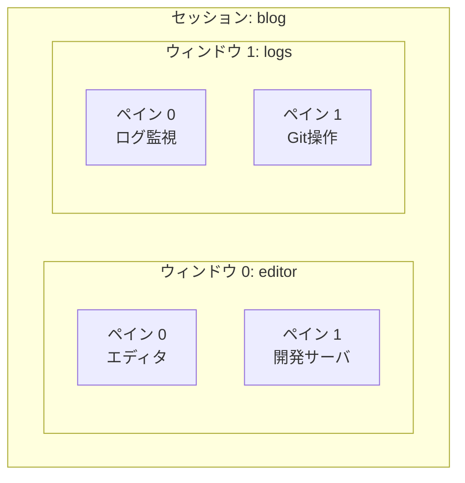

## はじめに

自宅のLinuxサーバへSSH接続して作業していると、通信が切れたときに実行中のコマンドまで終了してしまうことがあります。時間のかかる処理を動かしている場合や、複数のターミナルを行き来する場合に備えて、ターミナルマルチプレクサの`tmux`を導入しました。

この記事では、Ubuntuへのインストールから、セッションの作成・デタッチ・再接続、ウィンドウとペインの操作までを整理します。最後に、普段使うコマンドとキー操作をチートシートとしてまとめます。

今回の確認環境は次のとおりです。

- OS: Ubuntu 24.04.3 LTS
- tmux: 3.4
- 接続方法: SSH

記事内のキー操作は、`~/.tmux.conf`で変更していないデフォルト設定を前提としています。

## tmuxをインストールする

UbuntuやDebianでは、APTからtmuxをインストールできます。

```bash
sudo apt update
sudo apt install tmux
```

インストール後にバージョンを確認します。

```bash
tmux -V
```

今回の環境では、次のように表示されました。

```text
tmux 3.4
```

これでtmuxを利用する準備は完了です。

## tmuxとは

tmuxは、1つのターミナル上で複数のシェルやプログラムを扱うためのターミナルマルチプレクサです。ターミナルのタブに近い「ウィンドウ」と、画面分割に使う「ペイン」を組み合わせて作業できます。

SSHでサーバを操作するときは、作業を「セッション」としてサーバ側へ残せる点が特に便利です。SSH接続が切れてtmuxの画面から離れても、セッション内のプログラムは動作を続けるため、再接続して同じ画面へ戻れます。

ただし、tmuxはサーバの再起動をまたいで状態を保存する仕組みではありません。サーバを再起動するとtmuxのセッションも終了するため、必要なデータはファイルへ保存し、常時稼働させるサービスにはsystemdやDockerの再起動設定などを使います。

## セッション・ウィンドウ・ペインの構造

tmuxを使ううえでは、セッション・ウィンドウ・ペインの3つを押さえておくと操作を理解しやすくなります。



### セッション

セッションは、tmuxで管理する作業全体の単位です。`blog`、`docker`、`maintenance`のように用途ごとの名前を付けると、複数の作業を見分けやすくなります。

### ウィンドウ

ウィンドウは、セッション内に作る作業画面です。一般的なターミナルアプリのタブに近く、エディタ、Git操作、ログ確認などをウィンドウごとに分けられます。

### ペイン

ペインは、1つのウィンドウを分割した領域です。左側でエディタを開き、右側で開発サーバを実行するなど、複数のシェルを同時に表示できます。

## tmuxセッションを作成する

tmuxを引数なしで実行すると、自動的に番号が付いたセッションを作成して接続します。

```bash
tmux
```

サーバ作業では、あとから目的を判別できるように名前付きセッションを作成する方が管理しやすくなります。次のコマンドは、`blog`というセッションを作成して接続します。

```bash
tmux new -s blog
```

同じ名前のセッションがすでに存在する可能性がある場合は、`-A`を付ける方法もあります。`blog`セッションがあれば接続し、なければ新しく作成します。

```bash
tmux new -A -s blog
```

普段使うセッションが決まっている場合は、このコマンドを覚えておくと作成と再接続を1つにまとめられます。

## プレフィックスキーの押し方

tmux内の操作は、多くの場合`Ctrl + b`から始めます。この`Ctrl + b`はプレフィックスキーと呼ばれ、続けて押したキーによってtmuxへ操作を指示します。

例えば、セッションからデタッチするキー操作は次のように表します。

```text
Ctrl + b → d
```

実際には、次の順番で操作します。

1. `Ctrl`を押しながら`b`を押す
2. いったんキーを離す
3. `d`を押す

`Ctrl + b + d`を同時に押す操作ではありません。キー操作が分からなくなったときは、`Ctrl + b → ?`でデフォルトのキーバインド一覧を確認できます。

## デタッチして作業を残す

tmuxセッションと実行中のプログラムを残したまま、元のシェルへ戻る操作をデタッチと呼びます。

```text
Ctrl + b → d
```

デタッチすると、次のようなメッセージが表示されます。

```text
[detached (from session blog)]
```

SSH接続が意図せず切れた場合も、tmuxセッションはサーバ側に残ります。作業を終えるわけではなく一時的に離れる場合は、`exit`ではなくデタッチを使うと意図が明確です。

## セッションを確認して再接続する

起動中のセッションを確認するには、tmuxの外側で次のコマンドを実行します。

```bash
tmux ls
```

複数のセッションがある場合は、次のように表示されます。

```text
blog: 1 windows (created Sun Jul  5 15:30:00 2026)
docker: 2 windows (created Sun Jul  5 15:35:00 2026)
```

セッションが1つもない場合は、`no server running`と表示されます。これはtmuxの故障ではなく、接続できるセッションが存在しない状態です。

`blog`セッションへ再接続するには、対象名を指定します。

```bash
tmux a -t blog
```

`attach-session`の公式なエイリアスが`attach`です。さらに、tmuxは他のコマンドと区別できる範囲までコマンド名を省略できるため、普段の操作では`a`まで短くできます。

`tmux a`、`tmux at`、`tmux attach`、`tmux attach-session`はいずれも接続コマンドとして動作します。対話操作では短い`a`が便利ですが、手順書やスクリプトでは意味を読み取りやすい`attach`を使う方が分かりやすくなります。

対象を指定せずに`tmux a`を実行すると、直近に使った接続可能なセッションへ接続します。複数のセッションを使う場合は、意図しないセッションへ入らないように名前を指定する方が確実です。

## セッションを終了する

tmux内で`exit`を実行すると、現在のペインで動いているシェルが終了し、そのペインが閉じます。

```bash
exit
```

ウィンドウ内の最後のペインを閉じると、そのウィンドウも削除されます。セッション内の最後のウィンドウまで閉じると、セッション自体が終了します。

tmuxの外側からセッションを指定して終了する場合は、`kill-session`を使います。セッション内で動いている処理も終了するため、対象名を確認してから実行します。

```bash
tmux kill-session -t blog
```

## ウィンドウを操作する

1つのセッション内に複数のウィンドウを作ると、エディタ、Git操作、ログ確認などを切り替えられます。

| 操作 | キー |
| --- | --- |
| 新しいウィンドウを作成 | `Ctrl + b → c` |
| 次のウィンドウへ移動 | `Ctrl + b → n` |
| 前のウィンドウへ移動 | `Ctrl + b → p` |
| 番号を指定して移動 | `Ctrl + b → 0〜9` |
| セッション・ウィンドウ一覧を表示 | `Ctrl + b → w` |
| 現在のウィンドウ名を変更 | `Ctrl + b → ,` |

ウィンドウ名は、`editor`、`git`、`logs`、`docker`のように作業内容へ合わせて変更できます。画面下部のステータスバーで目的のウィンドウを見つけやすくなります。

## ペインを操作する

1つのウィンドウ内で複数の処理を同時に確認したい場合は、ペインを分割します。

| 操作 | キー |
| --- | --- |
| 左右に分割 | `Ctrl + b → %` |
| 上下に分割 | `Ctrl + b → "` |
| 上下左右のペインへ移動 | `Ctrl + b → 矢印キー` |
| ペイン番号を表示 | `Ctrl + b → q` |
| ペインを最大化／元に戻す | `Ctrl + b → z` |
| 現在のペインを閉じる | `exit` |

`Ctrl + b → z`は、ログやエディタを一時的に広く表示したいときに便利です。もう一度同じ操作をすると、元の分割状態へ戻ります。

## 過去の出力を確認する

tmux内で過去の出力を確認するときは、コピーモードへ入ります。

```text
Ctrl + b → [
```

コピーモードでは、矢印キーや`PageUp`、`PageDown`を使って表示位置を移動できます。確認を終えて通常の入力へ戻るには、`q`を押します。

コピー範囲の選択やOSのクリップボードとの連携は設定によって操作が変わるため、この記事ではスクロールによる確認までを扱います。

## tmuxチートシート

### セッション操作

| 操作 | 基本形 | 短縮形 |
| --- | --- | --- |
| tmuxを起動 | `tmux new-session` | `tmux` |
| 名前付きセッションを作成 | `tmux new-session -s セッション名` | `tmux new -s セッション名` |
| バックグラウンドにセッションを作成 | `tmux new-session -d -s セッション名` | `tmux new -d -s セッション名` |
| 存在すれば接続、なければ作成 | `tmux new-session -A -s セッション名` | `tmux new -A -s セッション名` |
| セッション一覧を表示 | `tmux list-sessions` | `tmux ls` |
| 直近のセッションに接続 | `tmux attach-session` | `tmux a` |
| 指定したセッションに接続 | `tmux attach-session -t セッション名` | `tmux a -t セッション名` |
| 他の接続を外してセッションに接続 | `tmux attach-session -d -t セッション名` | `tmux a -d -t セッション名` |
| セッション名を変更 | `tmux rename-session -t 旧名 新名` | `tmux rename -t 旧名 新名` |
| 指定したセッションを終了 | `tmux kill-session -t セッション名` | 同左 |

`tmux attach`は`attach-session`の公式エイリアスで、`tmux a`は一意な位置まで詰めた省略形です。`new`、`ls`、`rename`はtmuxのマニュアルに記載されている公式エイリアスです。

### セッション内の操作

| 操作 | キー |
| --- | --- |
| セッションからデタッチ | `Ctrl + b → d` |
| セッション一覧から選択 | `Ctrl + b → s` |
| 現在のセッション名を変更 | `Ctrl + b → $` |
| キーバインド一覧を表示 | `Ctrl + b → ?` |
| 指定したキーの説明を表示 | `Ctrl + b → /` |
| tmuxのコマンドプロンプトを開く | `Ctrl + b → :` |

### ウィンドウ操作

| 操作 | キー |
| --- | --- |
| 新しいウィンドウを作成 | `Ctrl + b → c` |
| 次／前のウィンドウへ移動 | `Ctrl + b → n`／`Ctrl + b → p` |
| 直前に表示していたウィンドウへ移動 | `Ctrl + b → l` |
| 番号を指定して移動 | `Ctrl + b → 0〜9` |
| セッション・ウィンドウ一覧から選択 | `Ctrl + b → w` |
| 現在のウィンドウ名を変更 | `Ctrl + b → ,` |
| 現在のウィンドウ番号を変更 | `Ctrl + b → .` |
| 現在のウィンドウを終了 | `Ctrl + b → &` |

`Ctrl + b → &`は、ウィンドウ内のすべてのペインと実行中の処理を終了します。通常は各ペインのシェルで`exit`を実行し、強制的に閉じたい場合だけ使う方が安全です。

### ペイン操作

| 操作 | キー |
| --- | --- |
| 左右／上下に分割 | `Ctrl + b → %`／`Ctrl + b → "` |
| 上下左右のペインへ移動 | `Ctrl + b → 矢印キー` |
| 次のペインへ移動 | `Ctrl + b → o` |
| 直前に使っていたペインへ移動 | `Ctrl + b → ;` |
| ペイン番号を表示して選択 | `Ctrl + b → q → 番号` |
| ペインを最大化／元に戻す | `Ctrl + b → z` |
| ペインを1セルずつリサイズ | `Ctrl + b → Ctrl + 矢印キー` |
| ペインを5セルずつリサイズ | `Ctrl + b → Alt + 矢印キー` |
| ペインを上／下のペインと入れ替え | `Ctrl + b → {`／`Ctrl + b → }` |
| ペインの配置を切り替え | `Ctrl + b → Space` |
| 現在のペインを終了 | `Ctrl + b → x` |

`Ctrl + b → x`は確認後に現在のペインと実行中の処理を終了します。シェルを正常終了できる場合は、ペイン内で`exit`を実行します。

### スクロール・コピーモード

| 操作 | キー |
| --- | --- |
| コピーモードに入る | `Ctrl + b → [` |
| コピーモードに入り1ページ戻る | `Ctrl + b → PageUp` |
| 1行ずつ移動 | `↑`／`↓` |
| 1ページずつ移動 | `PageUp`／`PageDown` |
| 下方向へインクリメンタル検索 | `Ctrl + s` |
| 上方向へインクリメンタル検索 | `Ctrl + r` |
| 次／前の検索結果へ移動 | `n`／`N` |
| コピーモードを終了 | `q`または`Esc` |

この表はデフォルトのEmacs形式を前提としています。`mode-keys vi`を設定している場合は検索や範囲選択のキーが変わります。

## SSH作業でよく使う流れ

SSH接続後に、作業用の名前付きセッションを作成します。

```bash
tmux new -A -s blog
```

必要に応じて、ウィンドウやペインを追加して作業します。作業を中断するときは、セッションを残したままデタッチします。

```text
Ctrl + b → d
```

次回のSSH接続後にセッションを確認し、同じ作業へ戻ります。

```bash
tmux ls
tmux a -t blog
```

まずは「名前付きセッションを作る」「デタッチする」「再接続する」という流れを覚えるだけでも、SSH作業を中断・再開しやすくなります。

## まとめ

tmuxを使うと、1つのSSH接続内で複数の作業画面を管理し、接続が切れたあともセッションへ戻れます。特に、時間のかかる処理やログ監視をサーバ上で行うときに役立ちます。

最初に覚えておきたいコマンドは、次の3つです。

```bash
tmux new -s blog
tmux ls
tmux a -t blog
```

tmux内では、デタッチ、ペイン分割、ペイン移動を覚えるところから始めると扱いやすくなります。

```text
Ctrl + b → d
Ctrl + b → %
Ctrl + b → "
Ctrl + b → 矢印キー
```

次は`~/.tmux.conf`を作成し、マウス操作やステータスバー、キーバインドを自分の作業に合わせて設定してみたいと思います。

## 参考資料

- [tmux公式Wiki：Getting Started](https://github.com/tmux/tmux/wiki/Getting-Started)
- [tmux公式Wiki：Installing](https://github.com/tmux/tmux/wiki/Installing)
