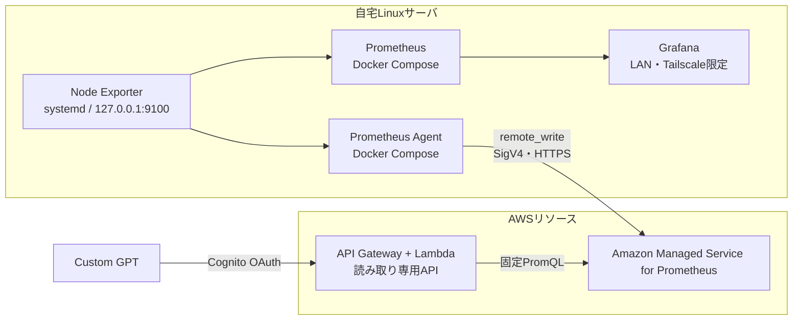

## はじめに

自宅Linuxサーバの状態を、ChatGPTから「今どうなっている？」と確認できるようにしました。ただし、GPTへSSH接続やサーバ操作の権限は渡していません。Prometheusで収集した監視値だけを返す小さなAPIを用意し、Custom GPTのActionsから呼び出す構成です。

この記事では、CPU使用率とメモリ使用率を自然言語で確認できるようになるまでの構成と、安全性のために絞った公開範囲をまとめます。実装は[linux-monitoring-gpt](https://github.com/Reotech736/linux-monitoring-gpt)で公開しています。

## できること

Custom GPTにサーバの状態を尋ねると、現在の監視値を日本語で要約します。


取得できる主な項目は次のとおりです。

| 項目 | 内容 |
| --- | --- |
| 到達可否 | Node Exporterを監視上確認できるか |
| CPU使用率 | 5分平均の使用率 |
| メモリ使用率 | 利用可能メモリから算出した使用率 |
| 補助情報 | 最大ディスク使用率、5分ロード、稼働時間、アラート |

一方で、次の操作はできないようにしています。

- サーバへのログイン、コマンド実行、設定変更
- 任意のPromQLや任意のホスト名の指定
- メトリクスや監視基盤への書き込み

## 全体構成

監視値の収集、保存、可視化、自然言語での確認を分けて構成しました。



外部へ公開するのは、Custom GPT用の読み取り専用APIだけです。Node Exporter、Prometheus、Prometheus Agentはインターネットへ公開せず、Grafanaも自宅LANとTailscaleからだけ使います。

なお、この構成で使っているのはMCPサーバではなく、Custom GPTのActionsです。OpenAPIスキーマでHTTP APIをActionとして登録しています。

## この構成にした理由

最初はGrafanaだけで確認する構成も考えました。時系列を詳しく見るにはGrafanaが適していますが、外出先からスマホで「CPUは高いか」「メモリは足りているか」を確認するには、ダッシュボードを開いて読み取る手間があります。

今回検討した選択肢と判断は次のとおりです。

| 選択肢 | 採らなかった、または役割を限定した理由 |
| --- | --- |
| Grafanaだけを使う | 詳細な時系列には向く一方、短い状態確認には情報量が多い |
| Node ExporterやPrometheusを公開する | 監視用ポートをインターネットへ出す必要があり、公開範囲が広くなる |
| GPTからAMPやサーバへ直接接続する | GPTに必要以上の接続先・権限・クエリ自由度を渡すことになる |
| 任意PromQLを受け付けるAPI | 便利だが、想定外の高コストなクエリや情報の露出を防ぎにくい |

そのため、GPTには状態確認に必要な値だけを返すAPIを渡し、監視基盤の詳細操作はGrafanaとAWS側へ残すことにしました。取得元のメトリクスをAMPへ保存しているため、インターネット接続とChatGPTが使える環境であれば、外出先のスマホからでも状態を確認できます。利用時はCognito OAuthで認証するため、GPTのリンクを知っているだけでは監視値を取得できません。

## 実装の流れ

### 1. Node Exporterでホストの状態を集める

Node Exporterはsystemdサービスとして動かし、`127.0.0.1:9100`だけで待ち受けます。Dockerコンテナ内ではなくホスト上で動かすことで、CPU、メモリ、ディスクなどOS全体の状態を素直に取得できます。

Prometheus AgentはDocker Composeで動かし、Node Exporterから必要なメトリクスだけを収集してAMPへ送信します。最初の成功条件は、AMP上で次の値が`1`になることでした。

```promql
up{host_id="home-server", job="node-exporter"}
```

### 2. Grafanaで時系列を確認する

GPTは現在値を短く確認するための入口です。推移や負荷の変化は、ローカルPrometheusとGrafanaで確認します。


Grafanaのダッシュボードには、次の値をまとめました。

- Node Exporterの稼働状態
- CPU使用率とメモリ使用率
- 最大ディスク使用率
- 1分・5分・15分のロードアベレージ

### 3. GPTには固定クエリのAPIだけを渡す

Custom GPTがサーバやAMPへ直接接続するのではなく、`GET /hosts/home-server/status`だけを公開しました。Lambdaが固定PromQLでAMPを照会し、GPTに必要な値だけをJSONで返します。

このAPIは`home-server`以外を受け付けず、任意のPromQLやシェルコマンドも受け付けません。APIが失敗したときは、GPTが正常と推測せず「監視APIが応答できなかった」と案内するようにしています。

### 4. Cognito OAuthで利用者を認可する

共有APIキーでは、GPTを使った利用者を区別できません。そこでCognito OAuth 2.0を使い、利用者ごとに認証する構成へ移行しました。

| 確認箇所 | 役割 |
| --- | --- |
| API Gateway | アクセストークン、client ID、`linux-monitoring/status.read`スコープを検証 |
| Lambda | Cognitoグループを確認し、対象ホストの閲覧を許可 |
| API | 固定クエリの読み取り結果だけを返す |

未認証はHTTP 401、閲覧グループ外はHTTP 403、AMPの照会失敗はHTTP 502として扱います。認証、認可、監視データの取得失敗を分けて確認できるようにしました。

## つまずいたところ

### Node Exporterのポート競合

待受アドレスを変更した際に、既存プロセスと再起動が重なって`address already in use`になりました。設定ファイルだけではなく、次の2点を分けて確認する必要がありました。

```bash
ss -ltnH | rg ':9100\b'
curl http://127.0.0.1:9100/metrics
```

### Cognitoのログイン画面とcallback URL

CognitoはApp Clientを作るだけではmanaged login画面を使えず、login brandingの設定も必要でした。また、callback URLは公開GPTのURLから推測せず、GPT Editorに表示された値をそのまま登録する必要があります。

OAuth Client SecretやAWS認証情報は、Git、OpenAPIスキーマ、記事本文、画面キャプチャへ保存しません。

## 現在の使い分けと今後

日常的な使い分けは次のとおりです。

- **Custom GPT**: 「今のCPUやメモリは大丈夫か」をすぐに確認する
- **Grafana**: 負荷や使用率の推移を時系列で確認する

今後は、Node ExporterやPrometheus Agentの停止、メトリクス欠損、閾値超過を安全に再現し、GPTが推測せず状況を説明できるかを検証します。その後、通知、必要なメトリクスの追加、複数ホスト対応を段階的に検討する予定です。

特に次の段階では、Dockerコンテナの稼働状況も確認できるようにしたいと考えています。コンテナ名を自由入力で受け付けるのではなく、監視対象と返却項目をAPI側で明示的に定義し、現在の読み取り専用・最小権限の方針を保ったまま診断APIを拡張する予定です。

## まとめ

Custom GPTにサーバ操作権限を渡さなくても、読み取り専用APIを挟めばCPU・メモリなどの状態を自然言語で確認できます。

- 監視の入口は`up == 1`という小さな成功条件から作る
- 時系列の確認はGrafana、現在値の問い合わせはCustom GPTに分ける
- 任意クエリを受け付けず、OAuthとグループで閲覧範囲を絞る
- AMPへ保存したメトリクスを使い、外出先からもChatGPTで状態を確認する

監視と公開範囲を少しずつ広げることで、自宅サーバの状態を安全に確認できる仕組みになりました。
