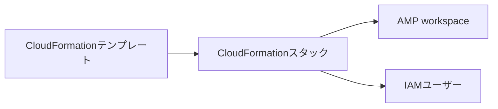

## はじめに

前回、自宅Linuxサーバの監視値をCustom GPTから確認できる環境を作りました。AWS側にはAMP、IAM、API Gateway、Lambda、Cognitoなど複数のリソースがあり、これらを手作業ではなく[Infrastructure as Code（IaC）](/terms/infrastructure-as-code/)で構築しました。

使用したのは[AWS CloudFormation](/terms/aws-cloudformation/)です。これが私にとって初めてのIaCだったため、使う前に疑問だったことと、実際に使って分かったことを初心者目線でまとめます。

この記事の要点は次の4つです。

- なぜAWSリソースをコードで管理するのか
- CloudFormationのテンプレートとスタックとは何か
- Linux監視環境でどのように使ったか
- 初めて使って便利だった点と注意点

## IaCとCloudFormationの基本

### なぜIaCを使うのか

AWS Management Consoleから一つずつ作る方法は、動きを理解しやすい一方、リソースが増えるほど手順と設定を追いにくくなります。IaCでは、必要なリソースと期待する状態をテキストファイルへ宣言します。

| 手作業で困りやすいこと | IaCで変わること |
| --- | --- |
| 作成手順を人が覚える | テンプレートに手順と設定が残る |
| 同じ環境でも設定差が出る | 同じ定義から繰り返し作成できる |
| 何を変更したか追いにくい | Gitで差分と理由を確認できる |
| リソース間の値をコピーする | 参照関係として記述できる |

AWS公式の[IaC解説](https://aws.amazon.com/what-is/iac/)でも、手作業ではなくコードでインフラを用意・維持し、再現可能な構成として扱う考え方が説明されています。

ただし、IaCにすれば設計や確認が不要になるわけではありません。権限、料金、削除時の影響を、レビューできる形にするための手段だと感じました。

### CloudFormationとは

CloudFormationは、テンプレートに記述したAWSリソースを作成・更新するサービスです。最初に覚えた用語は次の3つでした。

- **テンプレート**: 必要なリソースと設定をYAMLまたはJSONで記述したファイル
- **スタック**: 一つのテンプレートから作成・管理されるリソースのまとまり
- **変更セット**: スタックへ適用する予定の追加・変更・削除を事前確認する仕組み



リソース同士に参照関係がある場合は、CloudFormationが依存関係を判断して作成します。基本的な仕組みは、AWS公式の[CloudFormationユーザーガイド](https://docs.aws.amazon.com/AWSCloudFormation/latest/UserGuide/Welcome.html)でも確認できます。

## Linux監視環境での実践

### 今回作成した2つのスタック

Linux監視環境では、役割を分けて2つのスタックを使いました。

| スタック | 主な管理対象 |
| --- | --- |
| `linux-monitoring-gpt-amp` | AMP workspace、Agent用IAMユーザー |
| `linux-monitoring-gpt-diagnostic-api` | API Gateway、Lambda、Cognito、IAM |


スタック名と状態がまとまっているため、AWS側の構成をどの単位で管理しているか分かりやすくなりました。

### 最初は2つのリソースから始めた

最初のテンプレートで作成したのは、次の2リソースだけです。

- `AmpWorkspace`: Linuxサーバの監視メトリクスを保存するAMP workspace
- `AgentUser`: 対象workspaceへの`aps:RemoteWrite`だけを許可するIAMユーザー


テンプレートの中心部分は次のようになっています。

```yaml
Resources:
  AmpWorkspace:
    Type: AWS::APS::Workspace
    Properties:
      Alias: linux-monitoring-gpt-poc

  AgentUser:
    Type: AWS::IAM::User
    Properties:
      Policies:
        - PolicyName: amp-remote-write
          PolicyDocument:
            Statement:
              - Effect: Allow
                Action: aps:RemoteWrite
                Resource: !GetAtt AmpWorkspace.Arn
```

`!GetAtt AmpWorkspace.Arn`によって、作成したAMP workspaceのARNをIAMポリシーから参照しています。ARNを手でコピーせず、リソース同士の関係をテンプレート内に書ける点が印象に残りました。

アクセスキーは秘密情報として別管理するため、CloudFormationでは作成していません。すべてをIaCへ入れるのではなく、管理範囲を決めることも必要でした。

### 変更内容を見てから作成する

今回は、次の順序でスタックを作成しました。

1. `validate-template`でテンプレートを検証する
2. `create-change-set`で変更セットを作る
3. `describe-change-set`で対象リソースを確認する
4. `execute-change-set`で変更を実行する

IAMユーザーを作るため、変更セット作成時には`CAPABILITY_NAMED_IAM`も指定しました。権限に関わるリソースを作ることへ、明示的に了承するための指定です。

変更セットは、既存リソースの置換や削除へ気付くための大切な確認箇所です。ただし、AWS公式の[変更セットの説明](https://docs.aws.amazon.com/AWSCloudFormation/latest/UserGuide/using-cfn-updating-stacks-changesets.html)にもあるとおり、デプロイの成功を保証するものではありません。

### AWS SAMで構成を広げた

診断API側では、LambdaやAPI Gatewayを簡潔に書けるAWS Serverless Application Model（AWS SAM）を使いました。SAMはCloudFormationの拡張で、デプロイ時にはCloudFormationが扱うリソースへ変換されます。


最初は2リソースだったスタック管理を、API Gateway、Lambda、Cognitoを含む構成へ広げられました。SAMとCloudFormationの関係は、AWS公式の[AWS SAM概要](https://docs.aws.amazon.com/serverless-application-model/latest/developerguide/what-is-sam.html)でも説明されています。

## 使って分かったこと

### 実際に感じた利点

| 利点 | 実感したこと |
| --- | --- |
| 構成が残る | AMPの保持期間やIAM権限を後からテンプレートで確認できる |
| 差分を確認できる | Gitで、いつ何を変えたか追える |
| 依存関係を書ける | ARNなどの値を手作業でコピーせず参照できる |
| 管理単位が明確になる | 関連リソースをスタックとしてまとめられる |
| 変更前に確認できる | 変更セットで追加・変更・削除の予定を見られる |

一番大きかったのは、AWS環境を「画面で作ったもの」ではなく「Gitに残る構成」として考えられるようになったことです。

### 使って学んだ注意点

- **検証だけでは作成成功まで保証されない**: サービスクォータや実行時の条件によって失敗する可能性がある
- **変更内容によってはリソースが置換される**: データを持つリソースでは`Replacement`と削除ポリシーを確認する
- **コンソールで直接変更するとドリフトが生まれる**: テンプレートの期待状態と実際の設定がずれる
- **スタック外のリソースは自動で片付かない**: 手動作成したアクセスキーなどは別の削除手順が必要
- **IaCでも権限と料金の設計は必要**: 広すぎる権限や高コストな構成も、そのまま再現される

ドリフトの対象や制約は、AWS公式の[ドリフト検出ガイド](https://docs.aws.amazon.com/AWSCloudFormation/latest/UserGuide/using-cfn-stack-drift.html)で確認できます。

## まとめ

初めてのIaCは、小さな2リソースのテンプレートから始めました。今回の学びを短くまとめると、次のとおりです。

- IaCはインフラの期待状態をコードとして残す方法
- CloudFormationはAWSリソースをスタック単位で管理する
- 変更セットを確認してから適用する
- 秘密情報、権限、料金、削除方法は別途設計する
- コンソールで直接変更した場合はドリフトを意識する

便利さだけでなく、どこまでを管理し、何を確認するべきかも具体的に理解できました。今後もテンプレートを小さく変更し、差分を確認してから適用する流れを続けます。
