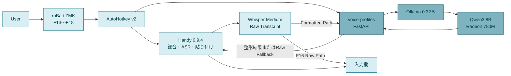
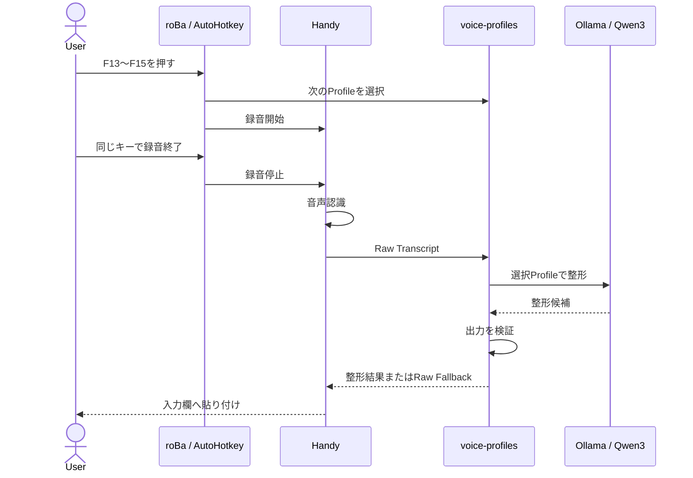

## はじめに

Windowsで使っている[Handy](/terms/handy/)の音声入力へ、用途別の文章整形を加える仕組みを作りました。[自動音声認識（ASR）](/terms/automatic-speech-recognition/)の後段に[ローカルLLM](/terms/local-llm/)を置き、AIへの指示、業務連絡、友人向けチャットに合う文体へ整える構成です。

構成は実機で動きました。しかし、待ち時間に見合う改善を安定して得られなかったため、現在はHandyのWhisper Mediumだけで文字起こしする運用に戻しています。

この記事は、作った仕組みと実測結果から「今は採用しない」と判断するまでの記録です。実装と評価データは[voice-profiles](https://github.com/Reotech736/voice-profiles)で公開しています。

## 何を作ろうとしたのか

Handyは、ショートカットで録音し、端末内で音声を文字へ変換して、フォーカス中の入力欄へ貼り付けるアプリです。音声入力だけならHandy単体で完結しますが、文字起こしにはフィラーや言い直しが残ることがあります。

そこで、文字起こし結果を次の3種類に整える機能と、AIを通さないRaw Pathを用意しました。

| 操作 | 目的 |
| --- | --- |
| Prompt | AIへの指示を整理する |
| Boss | 業務向けの自然な丁寧語へ整える |
| Friend | 元の口調を保ちながら読みやすくする |
| Raw | Handyの文字起こしをそのまま使う |

文章整形には、Windows上でQwen3を実行する[Ollama](/terms/ollama/)を利用しました。Handy自体は変更せず、Custom Post-Processing Providerと公開CLIから連携します。

## 全体構成

自作キーボードのroBaはF13〜F18をWindowsへ送り、AutoHotkey v2がプロファイル選択とHandyを操作します。Handyからlocalhostの[OpenAI互換API](/terms/openai-compatible-api/)へ文字起こしを渡し、`voice-profiles`がOllamaへ文章整形を依頼する構成です。

F16のRaw Pathは`voice-profiles`とLLMを完全に迂回します。APIやLLMが停止しても、Handyが使えれば音声入力を続けられるようにしました。

### HandyからローカルAPIへつなぐ

Handyの後処理プロバイダーを`Custom`にすると、任意のlocalhost APIを呼び出せます。ここへ`voice-profiles`が提供する最小限のOpenAI互換APIを設定しました。

APIは`127.0.0.1`だけで待ち受け、文字起こし本文を通常ログへ保存しません。LLM出力は自動送信せず、入力欄へ貼り付けた後に人が確認します。

### 1回の音声入力の流れ

Formatted Pathでは、押したキーに対応するプロファイルを次の要求1回だけ有効にします。これにより、HandyをフォークせずにPrompt、Boss、Friendを切り替えました。

タイムアウト、空出力、検証違反ではRaw Transcriptへ戻します。詳しい状態遷移は[MVPアーキテクチャ](https://github.com/Reotech736/voice-profiles/blob/main/docs/architecture.md)に残しています。

## Windows実機で試した構成

今回は構築手順の網羅ではなく、次の1環境で実用性を測りました。

| 項目 | 検証環境 |
| --- | --- |
| PC | GMKtec NucBox K12 |
| CPU / GPU | AMD Ryzen 7 H 255 / Radeon 780M |
| メモリ | 64GB |
| ASR | Whisper Medium |
| LLM | Ollama 0.32.5 / Qwen3 8B Q4_K_M |
| 推論経路 | Vulkan |

### 音声認識モデルを選ぶ

Handyには複数の音声認識モデルがあります。日本語中の英字・数字と動作の安定性を比較し、今回はWhisper Mediumを選びました。

| モデル | 実機での観察 |
| --- | --- |
| Whisper Medium | 英字と数字は比較的正確。空白や句読点が弱い |
| Nemotron Streaming 3.5 | 軽快だが、日本語中の英字・略語・数字で誤認識が目立つ |
| Cohere Transcribe | 単発精度は高いが、同じ英語句の長い反復を確認した |

固定音声では`Raw Path`が`Lowpass`になる誤認識もありました。後段のLLMだけで推測修正すると別の意味へ変える危険があるため、ASRと文章整形は分けて評価しています。条件は[Milestone 0 技術検証結果](https://github.com/Reotech736/voice-profiles/blob/main/docs/verification/milestone-0-results.md)に記録しました。

### ローカルLLMを選ぶ

Radeon 780MでLLMを動かすため、Ollamaの実験的な[Vulkan](/terms/vulkan/)経路を利用しました。Ollamaの[Windows向け資料](https://docs.ollama.com/windows)と[GPU対応資料](https://docs.ollama.com/gpu)でも、WindowsのAMD Radeon対応とVulkanの位置付けを確認できます。

| モデル | 常駐後の処理時間 | 判断 |
| --- | ---: | --- |
| Qwen3 8B Q4_K_M | 1.91〜2.09秒 | 暫定採用 |
| Qwen3 14B Q4_K_M | 3.30〜3.63秒 | 品質差が小さく不採用 |

Qwen3 8Bの推論中は、Radeon 780MのGPU使用率が約80%まで上がりました。内蔵GPUでモデル全体を動かせていることは確認できました。

短い固定入力では約2秒でしたが、これはOllama単体の測定です。詳細は[Milestone 1 ローカルLLM基盤 実測記録](https://github.com/Reotech736/voice-profiles/blob/main/docs/verification/milestone-1-results.md)に残しています。

## 12件を実際のAPI経路で評価する

最終判断では、匿名化したRaw Transcript 4件を3プロファイルへ投入しました。合計12件をtemperature 0、seed 42、10秒上限、リトライなしで実行した結果です。

| 指標 | 結果 |
| --- | ---: |
| Formatted / Raw Fallback | 6 / 6 |
| 自動品質条件まで合格 | 3 / 12 |
| 平均 / 最大 | 5.551秒 / 9.855秒 |
| 3秒以内 | 0 / 12 |
| 5秒以内 | 7 / 12 |

Ollama単体では約2秒だった8Bモデルも、実際のAPI経路では平均5.551秒かかりました。代表的な品質問題は次のとおりです。

- `F17ではなくF18`から`F17`を削除した
- 「笑は付けないでね」という明示情報を削除した
- Bossが丁寧語ではなく`大丈夫だ`へ変えた
- Friendは数秒待ってもRawとほぼ変わらない場合があった

英数字識別子の欠落を検出するvalidatorを追加すると、問題のある候補を貼り付けずRawへ戻せるようになりました。ただし、これは品質改善ではなく入力を守る安全策です。全結果は[12件プロファイル評価結果](https://github.com/Reotech736/voice-profiles/blob/main/docs/verification/evaluation-12-results.md)で確認できます。

## Handy単体の運用に戻した理由

Formatted Pathは平均約5.5秒待ったうえで、半分がRaw Fallbackになりました。自動品質条件を満たしたのも4分の1で、毎回待つほど安定した価値にはなっていません。

一方、HandyのWhisper Mediumだけを使う経路は速く、すでに日常の音声入力として便利でした。そのため現在は、次の運用にしています。

- 日常の既定はHandyによる通常の文字起こし
- AI整形は積極利用しない
- 実装と固定評価は、将来の再検証用に残す

HandyやローカルLLM全般が使えないという結論ではありません。今回のPC、モデル、プロンプトでは、既定経路にする価値を示せなかったという判断です。

## 再開条件

より高速な小型モデルやRadeon 780M向けランタイムが登場したときは、同じ12件を再実行します。再開の目安は次のとおりです。

- 平均3秒以内、12件すべて5秒以内
- 自動品質合格10 / 12以上
- 重大な意味変更が0件
- Raw Fallbackが例外的である
- 3プロファイルに待ち時間に見合う差がある

## まとめ

Handy、AutoHotkey、localhostのAPI、Ollama、Qwen3を組み合わせた音声入力環境は動きました。しかし、実経路では平均5.551秒、自動品質合格3 / 12となり、日常利用にはHandy単体の方が合っていました。

「動いた」と「毎日使える」を分けて評価できたことが、今回の一番の成果です。固定評価と再開条件を残したので、環境が進歩したときに同じ基準で試し直せます。
