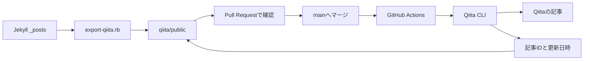

## はじめに

個人ブログの記事をQiitaにも掲載したいと考えました。しかし、同じ本文を2か所で編集すると、修正の反映漏れやリンク切れが起きやすくなります。

そこで、Jekyllの`_posts/`を正本にして、[Qiita CLI](/terms/qiita-cli/)用Markdownを生成する仕組みを追加しました。mainブランチへマージした記事だけを[GitHub Actions](/terms/github-actions/)からQiitaへ投稿します。

## 作った仕組み

記事の編集元は、これまでどおり`_posts/`だけです。



変換スクリプトは、次の処理を行います。

- Qiita用Front Matterへ変換
- ブログ内の相対URLを絶対URLへ変換
- 掲載元ブログの案内を末尾へ追加
- Qiitaの記事IDと更新日時を維持

生成先は`qiita/public/`です。生成物もGit管理し、Pull Requestで実際の投稿内容を確認できるようにしました。

## Qiita APIではなくQiita CLIを選んだ理由

Qiita APIを直接使う方法もありますが、今回は公式CLIを選びました。

| 方法 | 今回の判断 |
| --- | --- |
| Qiita API | 記事ID、リクエスト、エラー処理、プレビューを自前実装する必要がある |
| Qiita CLI | プレビュー、投稿、更新、記事ID管理を利用できる |

独自実装はJekyllからQiita形式への変換だけに絞り、投稿処理は公式ツールへ任せます。

使用したQiita CLIは`1.10.0`です。Node.jsは`22.22.1`以上を指定し、開発環境とCIではNode.js 24を使います。

```json
{
  "engines": {
    "node": ">=22.22.1"
  },
  "devDependencies": {
    "@qiita/qiita-cli": "1.10.0"
  }
}
```

```bash
npm install
npx qiita version
```

## ミラーする記事を明示する

Qiitaへ出したい記事だけに、次の設定を追加します。

```yaml
qiita:
  publish: true
  tags:
    - Qiita
    - QiitaCLI
    - GitHubActions
    - Jekyll
```

運用ルールは次のとおりです。

- `qiita.publish: true`を公開の意思表示とする
- Qiita用タグは1〜5個とし、空文字と重複を拒否する
- `false`へ変更した場合は、Qiitaの記事を削除せず同期だけを止める
- 記事の削除と公開範囲の変更は自動化しない

## Jekyll固有のリンクを変換する

ブログ内のルート相対URLは、そのままQiitaへ投稿するとリンク切れになります。

```markdown
[Qiita CLI](/terms/qiita-cli/)

```

変換後は、ブログの絶対URLになります。

```markdown
[Qiita CLI](https://reotech736.com/terms/qiita-cli/)

```

変換対象はMarkdownのリンクと画像、HTMLの`href`と`src`です。コード例を壊さないよう、fenced code block内は変換しません。

## 生成、確認、投稿の流れ

```bash
ruby scripts/export-qiita.rb
ruby scripts/export-qiita.rb --dry-run
ruby scripts/export-qiita.rb --check
mkdir -p qiita-preview/public
rsync -a --delete qiita/public/ qiita-preview/public/
npx qiita preview --root qiita-preview --config qiita-preview
```

各コマンドの用途は次のとおりです。

- 引数なし: Qiita用Markdownを生成
- `--dry-run`: ファイルを書き換えず変更予定を表示
- `--check`: 生成物が最新でなければエラー終了
- `qiita preview`: Git管理対象外の作業ディレクトリで表示を確認

Pull Requestでは`_posts/`と`qiita/public/`を確認してからmainへマージします。

プレビューを開くと、生成した記事が未投稿の記事として表示されます。


記事を選択すると、タイトル、タグ、本文、図をQiitaに近い表示で確認できます。


## GitHub Actionsから投稿する

mainブランチでは、生成物の検査後にQiita CLIを実行します。

```yaml
- name: Check generated Qiita articles
  run: ruby scripts/export-qiita.rb --check

- name: Publish articles
  env:
    QIITA_TOKEN: GitHub Actions Secretから設定
  run: npx qiita publish --all --root qiita
```

投稿後の処理も自動化しています。

- Qiita CLIが更新した`id`と`updated_at`をbotコミットでmainへ戻す
- ワークフローを直列実行し、記事IDの同時更新を防ぐ
- トークンは`QIITA_TOKEN`としてActions Secretへ登録する
- トークンをファイルやログへ出力しない

トークンには`read_qiita`と`write_qiita`権限が必要です。

## ローカルで確認した結果

変換スクリプトでは、次をテストしています。

- Front Matterとタグの検証
- 記事IDと更新日時の保持
- リンク変換とコードブロックの除外
- 同期停止と生成物の差分検出

```bash
ruby test/export_qiita_test.rb
```

8テスト、41 assertionsが成功し、`--check`とJekyllの本番ビルドも完了しました。Qiitaへの最初の公開対象はこの記事自身です。投稿後は記事IDの保存と、再実行時に重複せず更新されることを確認します。

## まとめ

Jekyllの記事を正本にし、形式の変換だけを自作して、投稿と記事ID管理はQiita CLIへ任せました。公開対象をFront Matterで明示し、生成結果をPull Requestで確認してから投稿する構成です。

まずはこの記事1本で新規投稿と更新を確認し、安定してから既存記事のミラーを検討します。
