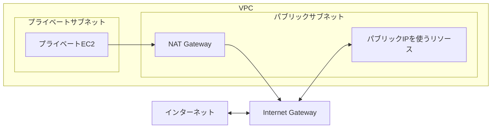

## 今日やったこと
- Internet GatewayとNAT Gatewayの役割を整理した
- Internet GatewayはVPCとインターネットを接続することを確認した
- NAT Gatewayは、プライベートサブネットから外部へ通信するために利用することを確認した
- NAT Gatewayを経由しても、インターネット側からプライベートEC2へ新しい接続は開始できないことを確認した

## 学んだこと
### Internet Gatewayとは

Internet Gatewayは、VPCとインターネットを接続するためのゲートウェイ。

VPCにInternet Gatewayをアタッチし、パブリックサブネットのルートテーブルに次の経路を設定する。

```text
送信先: 0.0.0.0/0
ターゲット: Internet Gateway
```

ただし、Internet Gatewayへのルートがあるだけでは、EC2がIPv4でインターネットと通信できるとは限らない。

主に以下の条件も必要になる。

```text
- EC2にパブリックIPv4アドレスまたはElastic IPがある
- セキュリティグループで通信が許可されている
- ネットワークACLで通信が許可されている
```

Internet Gatewayは、パブリックIPを持つリソースとインターネットとの通信に使用する。

### NAT Gatewayとは

NAT Gatewayは、プライベートサブネット内のリソースから、インターネットなどのVPC外部へ通信するために使用する。

代表的な用途は以下。

```text
- EC2からOSの更新ファイルを取得する
- 外部APIへアクセスする
- パッケージリポジトリへ接続する
```

パブリックNAT Gatewayは、パブリックサブネットに配置し、Elastic IPを割り当てる。

プライベートサブネットのルートテーブルには、NAT Gatewayへの経路を設定する。

```text
送信先: 0.0.0.0/0
ターゲット: NAT Gateway
```

### 通信経路



プライベートEC2からの通信は、次の経路を通る。

```text
プライベートEC2
  ↓
NAT Gateway
  ↓
Internet Gateway
  ↓
インターネット
```

NAT Gatewayは、EC2のプライベートIPv4アドレスを自身のアドレスへ変換して通信する。

戻りの通信はEC2へ転送されるが、インターネット側からプライベートEC2へ新しい接続を開始することはできない。

### 違いを整理する

| 項目 | Internet Gateway | NAT Gateway |
| --- | --- | --- |
| 主な役割 | VPCとインターネットを接続する | プライベートリソースの外向き通信を実現する |
| 関連付ける場所 | VPC | サブネットに作成 |
| 主な利用元 | パブリックIPを持つリソース | プライベートIPのみのリソース |
| 外向き通信 | 可能 | 可能 |
| インターネットからの新規接続 | 構成次第で可能 | プライベートリソースへは不可 |
| Elastic IP | Gateway自体には不要 | パブリックNAT Gatewayに必要 |

### Internet GatewayとNAT Gatewayは組み合わせて使う

Internet GatewayとNAT Gatewayは、どちらか一方を選ぶものではない。

パブリックNAT Gatewayからインターネットへ通信するには、同じVPCのInternet Gatewayが必要になる。

```text
Internet Gateway:
  VPCとインターネットをつなぐ

NAT Gateway:
  プライベートリソースの送信元アドレスを変換し、
  Internet Gatewayまで通信を中継する
```

### SAAでの判断基準

```text
インターネットからアクセスを受けるALBなど
  → パブリックサブネット + Internet Gateway

プライベートEC2から外部へアクセスしたい
  → プライベートサブネット + NAT Gateway

インターネットからプライベートEC2へ直接接続させたくない
  → NAT Gatewayによる外向き通信
```

NAT Gatewayは外向き通信を可能にする仕組みであり、プライベートEC2をインターネットへ直接公開するものではない。

## 次にやること
- NAT Gatewayを複数のAvailability Zoneに配置する理由を整理する
- VPCエンドポイントとNAT Gatewayの使い分けを整理する
- ルートテーブルのルート選択方法を整理する
- ALBをパブリックサブネットへ配置する理由を整理する
