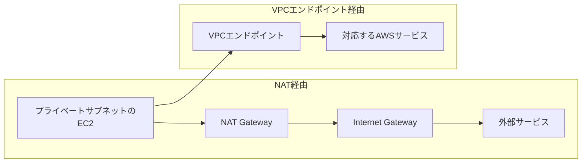

## 今日やったこと
- NAT GatewayとVPCエンドポイントの役割を整理した
- NAT Gatewayは、外部サービスを含む汎用的な外向き通信に利用できることを確認した
- VPCエンドポイントを使うと、Internet GatewayやNAT Gatewayを経由せずに対応サービスへ接続できることを確認した
- Gateway型とInterface型のVPCエンドポイントの違いを整理した

## 学んだこと
### NAT Gatewayを使う場合

NAT Gatewayは、プライベートサブネット内のリソースからVPC外部へ接続するために利用する。

```text
- OSやパッケージの更新
- 外部APIへのアクセス
- VPCエンドポイントを用意していないAWSサービスへのアクセス
```

通信経路は次のようになる。

```text
プライベートEC2
  ↓
NAT Gateway
  ↓
Internet Gateway
  ↓
外部サービスやAWSサービスのパブリックエンドポイント
```

NAT Gatewayは幅広い宛先へ接続できる一方、利用時間と処理したデータ量に応じて料金が発生する。

### VPCエンドポイントを使う場合

VPCエンドポイントは、VPC内のリソースから対応サービスへプライベートに接続する仕組み。

Internet GatewayやNAT Gatewayを経由せず、プライベートIPのまま通信できる。



VPCエンドポイントは対応するサービスにだけ接続するため、外部Webサイトや任意のAPIへの汎用的な接続には利用できない。

### Gateway型VPCエンドポイント

Gateway型は、主に次のサービスへ接続するために使用する。

```text
- Amazon S3
- Amazon DynamoDB
```

対象サービスへの通信をVPCエンドポイントへ送るルートが、関連付けたルートテーブルに追加される。

```text
プライベートEC2
  ↓
Gateway型VPCエンドポイント
  ↓
S3またはDynamoDB
```

Gateway型には追加料金がかからない。

プライベートサブネットからS3やDynamoDBへアクセスするだけなら、NAT GatewayではなくGateway型VPCエンドポイントを使う構成が有力になる。

### Interface型VPCエンドポイント

Interface型はAWS PrivateLinkを利用し、多くのAWSサービスなどへプライベートに接続する。

指定したサブネットに、プライベートIPを持つENIが作成される。

```text
プライベートEC2
  ↓
VPC内に作成されたENI
  ↓
対応するAWSサービス
```

Interface型では、エンドポイントへセキュリティグループを設定できる。

一方で、エンドポイントの利用時間と処理したデータ量に応じた料金が発生する。

### 違いを整理する

| 項目 | NAT Gateway | Gateway型エンドポイント | Interface型エンドポイント |
| --- | --- | --- | --- |
| 接続先 | 外部を含む幅広い宛先 | S3、DynamoDB | PrivateLink対応サービス |
| Internet Gateway | 外部接続時に必要 | 不要 | 不要 |
| NAT Gateway | 自身を利用 | 不要 | 不要 |
| 主な仕組み | 送信元アドレス変換 | ルートテーブル | ENIとプライベートIP |
| 料金 | 時間・データ処理料金 | 追加料金なし | 時間・データ処理料金 |
| セキュリティグループ | 設定しない | 設定しない | ENIに設定する |

### 使い分け

```text
外部APIやパッケージリポジトリへ接続したい
  → NAT Gateway

S3やDynamoDBへプライベートに接続したい
  → Gateway型VPCエンドポイント

PrivateLink対応サービスへプライベートに接続したい
  → Interface型VPCエンドポイント
```

NAT GatewayとVPCエンドポイントは、どちらか一方だけを選ぶものではない。

```text
AWSサービスへの通信:
  VPCエンドポイント

それ以外の外向き通信:
  NAT Gateway
```

のように、同じVPC内で併用できる。

SAAでは、セキュリティの向上やNAT Gatewayの通信量削減が求められる場合、VPCエンドポイントが選択肢になりそう。

## 次にやること
- Gateway型とInterface型VPCエンドポイントの違いを詳しく整理する
- VPCエンドポイントポリシーの役割を整理する
- NAT GatewayをAvailability Zoneごとに配置する理由を整理する
- S3への通信でGateway型VPCエンドポイントを使う構成を整理する
